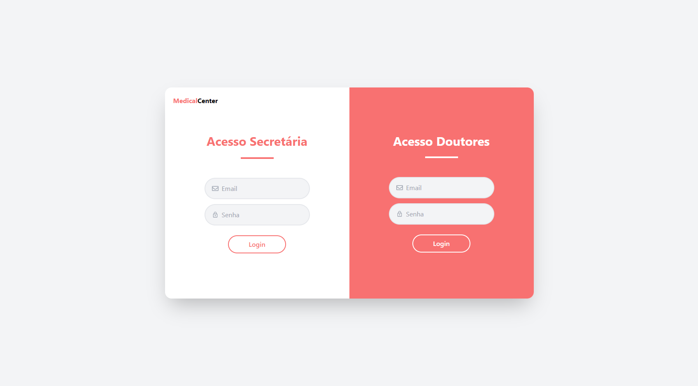
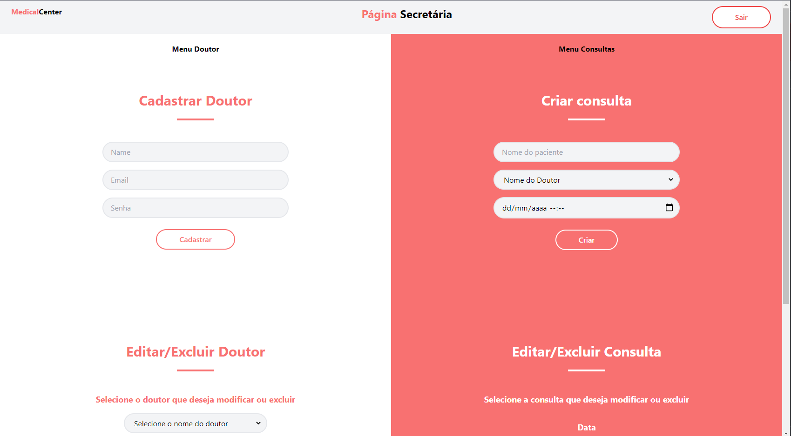
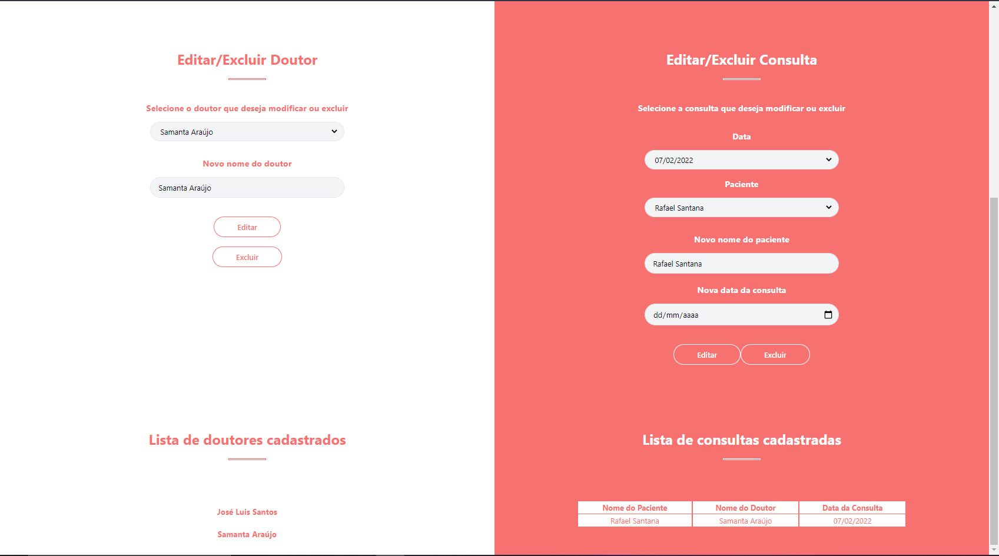
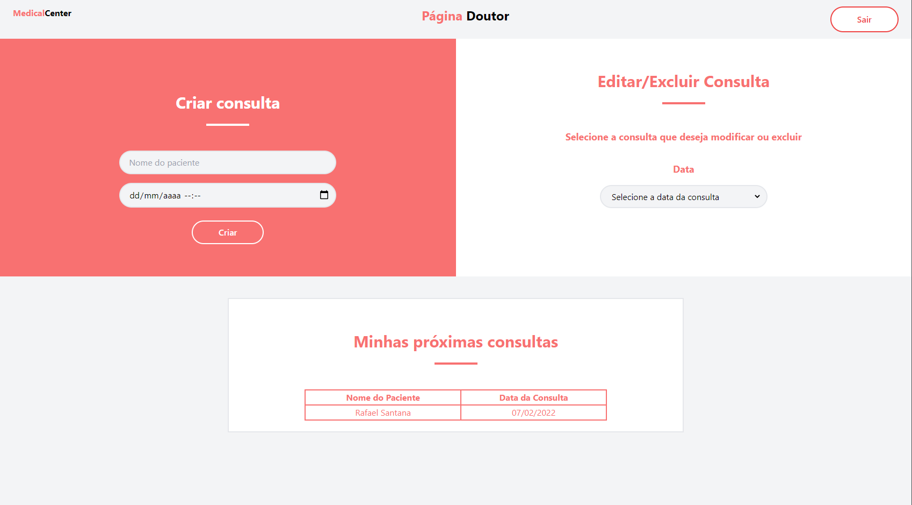

<h1 align="center">Medical Center</h1>


<h3 align="center"> 
	Status: 🚧 Making deploy
</h3>

---

## 🏆 About the App

<p style="text-align: justify;">&emsp;&emsp; 
Medical center is a web app focused to attend medical clinics. Its objective is to facilitate the organization of the center's doctor's schedules. 
Besides the doctors as users, it will also be used by some secretarys, who can control multiple doctors' schedules.
</p>

## 💻 Aplication

<p align="center">
    <h1>Login Page</h1>
    
</p>

<p align="center">
    <h1>Secretary Home 1</h1>
    
</p>

<p align="center">
    <h1>Secretary Home 2</h1>
    
</p>

<p align="center">
    <h1>DoctorHome</h1>
    
</p>

## 🚀 Running the App

### 🛠 Requeriments and technologies

- Docker;
- Docker-compose;
- Node/ npm;

#### Front End - [ReactJs](https://reactjs.org/)

#### Back End - [NodeJs](https://nodejs.org/en/) + [Postgresql](https://www.postgresql.org/)

### Installing and running

#### Running Docker

with [Docker](https://docs.docker.com/get-docker/) installed, run the commands:

```bash
# Create docker container
$ docker-compose up -d
```

#### Running Backend

```bash
# Clone the repo
$ git clone https://github.com/enzoggqs/medical-center
$ cd medical-center
```

```bash
# Installing packages
$ npm install
```

```bash
# Applying migrations
$ npx prisma migrate dev
```

```bash
# Running server
$ npm run dev
```

**The local backend will run on port :** [localhost:3333](http://localhost:3333/)\*

#### Running Frontend

- Open other terminal of the cloned project

```bash
# Go to frontend folder
$ cd medical-center-front
```

```bash
# Installing packages and running the page
$ npm install
$ npm start
```

**The local frontend will run on port :** [localhost:3000](http://localhost:3000/)\* <br><br>

<i>_You need to run frontend and backend simultaneously for the app to works properly_</i>

## 💆‍ Developers

<div align="center">
    <a href="https://github.com/enzoggqs">
        
        <br />
        <sub>
            <b>Enzo Gabriel</b>
        </sub>
    </a>
    <br />
    <a href="https://github.com/enzoggqs">
    </a>
</div>
